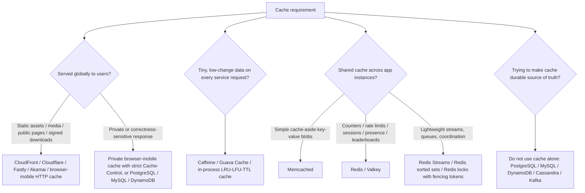

# Cache Cheatsheet

## Visual Decision Tree

Use this first under interview pressure. Every leaf names concrete choices; open the matching `individual-analysis/` file for details.

```text
Cache requirement
|-- Is the content served globally to users?
|   |-- Static assets, media, public pages, signed downloads
|   |   +-- CloudFront, Cloudflare, Fastly, Akamai, browser/mobile HTTP cache
|   +-- Private or correctness-sensitive personalized response
|       +-- Private browser/mobile cache with strict Cache-Control, or authoritative PostgreSQL/MySQL/DynamoDB
|-- Is the data tiny, low-change, and needed on every service request?
|   +-- Caffeine, Guava Cache, in-process LRU/LFU/TTL cache
|-- Do multiple app instances need a shared cache?
|   |-- Simple cache-aside key-value blobs only
|   |   +-- Memcached
|   |-- Counters, rate limits, sessions, presence, sorted sets, leaderboards
|   |   +-- Redis, Valkey
|   +-- Lightweight streams/queues or coordination with careful tradeoffs
|       +-- Redis Streams, Redis sorted sets, Redis locks with fencing tokens
+-- Is the cache meant to become durable source of truth?
    +-- Do not use cache alone; use PostgreSQL/MySQL, DynamoDB, Cassandra, Kafka, or another durable store
```

## Rendered Decision Diagram

If your Markdown preview supports Mermaid, this renders as a flowchart.



## 30-Second Rule

Use a cache for hot, repeated, expensive, or safely stale data. Keep the database or durable store authoritative unless you explicitly design persistence, recovery, and loss behavior.

Interview phrase: "The cache improves latency and protects the primary database, but it is derived and rebuildable."

## When To Add Cache

- Read-heavy endpoint is overloading the database.
- Same expensive computation is repeated often.
- Data has a clear freshness tolerance.
- The working set fits memory.
- You need TTL-based ephemeral state.
- You need fast counters, rate limits, presence, sessions, or leaderboards.

## When Not To Add Cache

- The data changes so often that invalidation dominates.
- The correctness invariant requires fresh authoritative state.
- The working set is too large or unpredictable.
- The bottleneck is not reads or repeated computation.
- The team cannot tolerate stale reads or operational complexity.

## Decision Tree

### 1. Is The Data Authoritative?

- Yes: use a durable database; cache only derived reads.
- No: cache is appropriate if data can be recreated or safely lost.

### 2. What Is The Access Pattern?

- Hot object lookup with rich structures/counters: Redis.
- Simple distributed key-value object cache: Memcached.
- Tiny low-change data needed on every request: local/in-process cache.
- Static/media/public global content: CDN/edge/client cache.
- Expensive aggregate/read model: materialized value with TTL or event invalidation.
- Rate limiting: atomic counters with TTL.
- Leaderboard: sorted set.
- Presence/session: TTL-backed ephemeral keys.
- Queue/stream: use only for lightweight workflows; durable queues are safer for critical work.

### 3. How Fresh Must It Be?

- Seconds/minutes stale is fine: TTL.
- Must update after writes: explicit invalidation or write-through.
- User must see own write: bypass cache, update cache on write, or use versioned/session-aware reads.

## Cache Patterns

| Pattern | How It Works | Best For | Risk |
|---|---|---|---|
| Cache-aside | App reads cache, loads DB on miss, writes cache | Common hot reads | Stampede and stale values |
| Write-through | App writes cache and DB together | More consistent reads | More write latency/complexity |
| Write-behind | App writes cache first, flushes DB later | Very fast writes | Data loss/order risk |
| Read-through | Cache layer loads from DB | Managed cache abstraction | Hidden complexity |
| Refresh-ahead | Refresh before expiry | Predictable hot keys | Wasted work |

## Cache Choice Matrix

| Choice | Best For | Avoid When | Interview Reasoning |
|---|---|---|---|
| Redis | Counters, rate limits, sessions, sorted sets, leaderboards, presence, rich data structures | You only need simple object caching | "I need atomic structures or richer cache behavior, not just key-value blobs." |
| Memcached | Simple distributed cache-aside object caching | You need persistence, sorted sets, scripts, streams, or richer operations | "The cache is disposable and key-value only, so simplicity is a feature." |
| Local/In-Process | Tiny low-change data on every request | Immediate global invalidation or large working sets | "This avoids a network hop, but I will bound TTL and memory because each instance has its own copy." |
| CDN/Edge/Client | Static assets, media, public pages, globally read-heavy content | Private or correctness-sensitive personalized responses | "Serve content close to users and keep origin/database out of the hot path." |

## Invalidation Choices

- TTL: simple, accepts bounded staleness.
- Delete on write: common with cache-aside.
- Update on write: fresher but can race.
- Versioned keys: avoid old overwrites and simplify invalidation.
- Event-driven invalidation: good for distributed systems, must handle lag and missed events.

## Failure Modes

- Cache stampede: many requests miss at once.
- Cache penetration: repeated misses for nonexistent keys.
- Cache avalanche: many keys expire together.
- Hot key: one key overloads one cache shard.
- Stale data: cache returns old value after write.
- Eviction surprise: memory pressure removes important keys.
- Split source of truth: app treats cache as authoritative by accident.

## Mitigations

- Add jitter to TTLs.
- Use request coalescing/single-flight on miss.
- Cache negative lookups briefly.
- Use soft TTL plus background refresh.
- Add per-key locks carefully.
- Shard or replicate hot keys.
- Set clear eviction policy and memory alerts.
- Monitor hit rate, latency, evictions, memory, and hot keys.

## Interview Phrases That Land Well

- "I would not make the cache authoritative; it is rebuildable."
- "I will use TTL first because it is simple, then add explicit invalidation if freshness requires it."
- "This cache can serve stale data for N seconds; user-owned writes can bypass or update the cache."
- "I need stampede protection because the database is most vulnerable exactly when hot keys expire."
- "For correctness-sensitive mutations, I will enforce the invariant in the database, not in Redis alone."

## Red Flags

- Using Redis as durable storage without persistence and recovery discussion.
- Ignoring cache invalidation after writes.
- No plan for stampede/hot keys.
- Caching every query instead of the working set.
- Caching data with no freshness tolerance.
